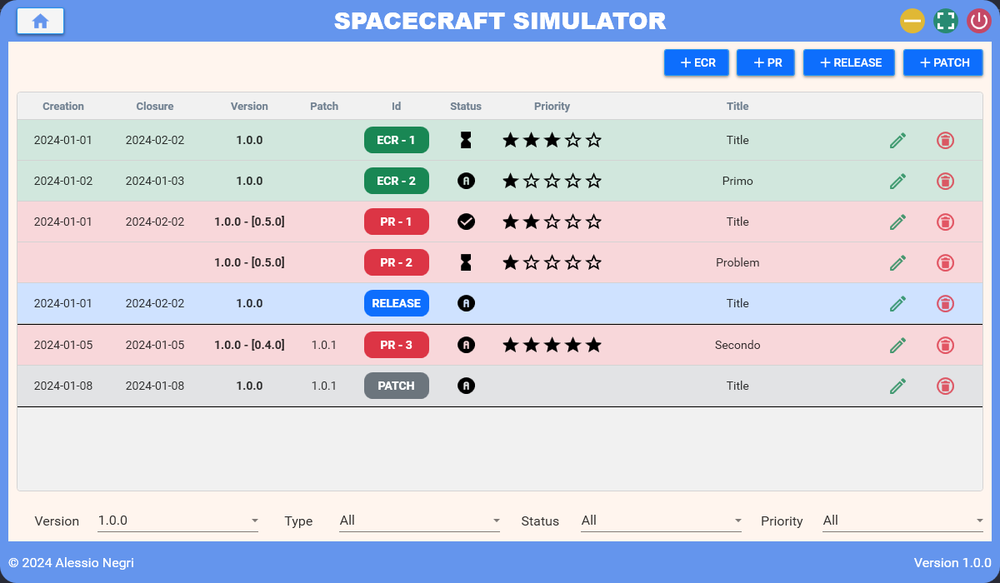

# ProjectsTracker

Track features and bugs across multiple projects

## Table Of Contents

1. Introduction
	- Languagaes & Libraries
	- Project's Structure
	- References
		- GitHub Repositories
2. Dashboard
	- Add Project
	- Add Solution
	- Edit Project
	- Edit Solution
	- Delete Project / Solution
	- Move Project
3. Solution
	- Add Sub Project
	- Edit Sub Project
	- Delete Sub Project
	- Extract Sub Project
4. Project
	- Add ECR
	- Add PR
	- Add RELEASE
	- Add PATCH
	- Edit Row
	- Delete Row

## 1. Introduction

The `Projects Tracker` application has the objective to keep track of **Engineering Change Requests** (ECR)
and **Problem Reports** (PR) for different projects.

### 1.1 Languages & Libraries

The application is developed in `C# 12 - .NET 8.0` and uses the following packages:

- `MaterialDesignThemes 5.1.0` for material design
- `Microsoft.Data.Sqlite 8.0.7` for SQLite database management
- `Microsoft.Extensions.DependencyInjection 8.0.0` for page navigation
- `Newtonsoft.Json 13.0.3` for JSON conversion of SQL query results
- `SharpVectors.Wpf 1.8.4` for including .svg icons

The front-end is developed in `WPF` using the `XAML` language.

### 1.2 Project's Structure

The project is structured in the following folders.

- `icons`: icons used in the GUI
- `images`: README images
- `rc`: resources
	- `rc\ResourceDictionaries`: resource dictionaries from Microsoft
- `src`: back-end of the application
	- `Database`: all interfaces with SQLite database
	- `Models`: models
	- `MVVM`: ModelView-ViewModel design pattern
	- `Services`: services for page navigation
	- `Utility`: list of useful methods
	- `ViewModels`: view models (MVVM)
- `ui`: front-end of the application
	- `Dialogs`: list of dialogs
	- `Pages`: list of pages
	- `UserControls`: list of user controls used in the GUI
- `App.xaml`: root file of the project
- `MainWindow.xaml`: main view of the project

### 1.3 References

#### GitHub Repositories

> **MaterialDesignInXamlToolkit**
> - `URL` https://github.com/MaterialDesignInXAML/MaterialDesignInXamlToolkit

## 2. Dashboard

The application opens on the **Dashboard**. It contains two types of card:

- `Standalone Projects`: projects not inside a solution,
- `Solutions`: container for multiple sub projects that are grouped together.

Each Project/Solution is represented with a card divided into three parts:

- `Header` containing the wording **PROJECTS** / **SOLUTION**
- `Body` containing the name of the item and other informations
- `Footer` containing the buttons for editing / deleting

### 2.1 Add Project

By clicking on the `Add Project` button, a dialog appears allowing the user to create a new project,
giving the following parameters:

- `Project Name`
- `Solution Reference`
	- `No Solution` creates a standalone project
	- `Create New Solution` creates a new solution (with the given name) and insert the project inside
	- `Add To Existing Solution` moves the project in the selected solution

### 2.2 Add Solution

By clicking on the `Add Solution` button, a dialog appears allowing the user to create a new solution,
giving the following parameters:

- `Solution Name`

### 2.3 Edit Project

By clicking on the `Edit` button on a project card, a dialog appears allowing the user to modify
a project's parameters:

- `Project Name`
- `Solution Reference`
	- `No Solution` leave it as a standalone project
	- `Create New Solution` creates a new solution (with the given name) and insert the project inside
	- `Add To Existing Solution` moves the project in the selected solution

### 2.4 Edit Solution

By clicking on the `Edit` button on a solution card, a dialog appears allowing the user to modify
a solution's parameters:

- `Solution Name`
- `Extract All Sub-Projects` if checked extracts all the sub-projects and turn them into standalone ones

### 2.5 Delete Project / Solution

By clicking on the `Delete` button on a project/solution card, a dialog appears allowing the user to
delete a project / solution. Pay attention that by removing a solution, all the sub-projects inside
will be deleted too: before confirming, it could be better to extract all subprojects.

### 2.6 Move Project

A project can be moved inside a solution by dragging it.

## 3. Solution

By clicking on a solution card you enter in the `Solution` page. It is very similar to the dashboard
one, a part that only the sub projects are shown.

The user can go back to the dashboard page by clicking on the `Home Icon`.

### 3.1 Add Sub Project

By clicking on the `Add Sub Project` button, a dialog appears allowing the user to create a new
sub project, giving the following parameters:

- `Sub Project Name`
- `Solution Reference`
	- `Leave In Solution` creates a project in the current solution
	- `Extract From Solution` moves the created project in the dashboard as standalone
	- `Add To Existing Solution` moves the project in the selected solution

### 3.2 Edit Sub Project

By clicking on the `Edit` button on a sub project card, a dialog appears allowing the user to modify
a project's parameters:

- `Project Name`
- `Solution Reference`
	- `No Solution` leave it as a standalone project
	- `Create New Solution` creates a new solution (with the given name) and insert the project inside
	- `Add To Existing Solution` moves the project in the selected solution

### 3.3 Delete Sub Project

By clicking on the `Delete` button on a sub project card, a dialog appears allowing the user to
delete a sub project.

### 3.4 Extract Sub Project

A sub project can be extracted from the solution by dragging it over the orange icon.

## 4. Project

By clicking on a project / sub-project card you can enter in the `Project` page, which is
composed of three parts:

- At the top there are the buttons to add a new **ECR / PR / RELEASE / PATCH**
- In the middle there is the table comprising the following informations
	- Creation Date
	- Closure Date
	- Version plus the Discovery Version for PR
	- Patch Version
	- Identifier
	- Status (Assigned - In Progress - Done)
	- Priority (1 - 2 - 3 - 4 - 5)
	- Title
	- Actions (Edit - Delete)
- At the bottom there are the filters for the table (by default only the last version
is displayed)

### 4.1 Add ECR

By clicking on the `Add ECR` button, a dialog appears allowing the user to create a new
**Engineering Change Request**, giving the following parameters:

- `Importance`
- `Status`
- `Creation Date`
- `Closure Date`
- `Version`
- `Patch Version`
- `Title`
- `Description`

### 4.2 Add PR

By clicking on the `Add PR` button, a dialog appears allowing the user to create a new
**Problem Report**, giving the following parameters:

- `Importance`
- `Status`
- `Creation Date`
- `Closure Date`
- `Version`
- `Patch Version`
- `Discovery Version`
- `Title`
- `Description`
- `Note`

### 4.3 Add RELEASE

By clicking on the `Add RELEASE` button, a dialog appears allowing the user to create a new
**Release**, giving the following parameters:

- `Status`
- `Version`
- `Creation Date`
- `Closure Date`

### 4.4 Add PATCH

By clicking on the `Add PATCH` button, a dialog appears allowing the user to create a new
**Patch**, giving the following parameters:

- `Status`
- `Version`
- `Creation Date`
- `Closure Date`
- `Patch Version`

### 4.5 Edit Row

By clicking on the `pencil` button, a dialog appears allowing the user to edit the
given row.

### 4.6 Delete Row

By clicking on the `trash bin` button, a dialog appears allowing the user to delete the
given row.

